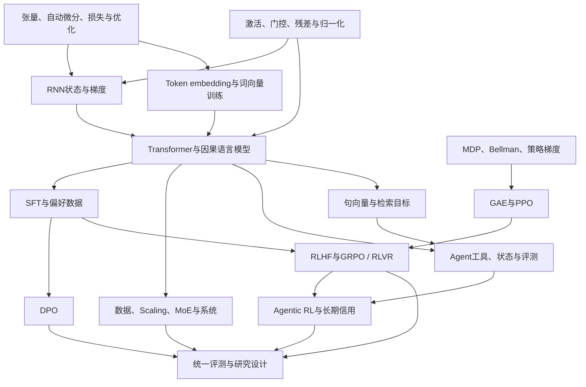

# 学习路线与发展脉络：每一步在解决什么问题

[总目录](../README.md) · [月度任务与验收](年度学习任务与验收.md) · [书籍地图](参考书籍与课程地图.md) · [论文索引](论文索引.md)

这份路线围绕年度目标：以后训练与推理 RL 为主线，以基座训练和 Agent 系统为支撑。范围覆盖本项目八个目录，不是整个机器学习学科的完整历史。学习顺序、研究发表顺序和实际系统流水线是三件不同的事；先把它们分开，再连接。

## 1. 先看知识依赖，再按年度优先级学习

图中箭头代表重要先修关系，不代表必须完成所有父节点的全部章节。例如第 2 月开始 SFT 不需要先通读 RL；第 3 月理解 DPO 需要 KL 和偏好模型，但不必先训练完整 PPO。Agentic RL 则确实需要先理解工具运行和策略更新，两边缺一边都容易把问题归因错。

| 目录 | 它回答的核心问题 | 进入下一段前的证据 |
| --- | --- | --- |
| [激活函数](../激活函数/README.md) | 网络怎样引入非线性，局部导数有何限制 | 推导 GELU / SiLU；解释残差不等于稳定性保证 |
| [pytorch&mindspore](../pytorch&mindspore/README.md) | 数学目标怎样变成可求导、可恢复的程序 | 手算/有限差分/AD 一致；恢复优化器状态 |
| [RNN](../RNN/README.md) | 历史怎样被压缩，梯度为何跨时间衰减 | 展开计算图；区分模型递归状态与环境充分状态 |
| [transformer](../transformer/README.md) | token 如何变成向量，如何并行建模前缀并训练语言模型 | 查表梯度、labels、mask、loss、训练、验证、生成能连起来 |
| [RL](../RL/README.md) | 如何从交互结果优化决策 | Bellman 手算；策略梯度、baseline、PPO 条件 |
| [post_train](../post_train/README.md) | 示范、偏好与可验证奖励分别怎么训练 | 同任务的 SFT / DPO / RLVR 对照和失败分析 |
| [agent_design](../agent_design/README.md) | 模型怎样接工具并形成可检查的任务系统 | 可重放轨迹、预算、工具错误与终止原因 |
| [agentic_rl](../agentic_rl/README.md) | 如何为多步交互分配奖励并更新策略 | token/调用两层时间尺度、mask、成本与控制实验 |

## 2. 三条相交的发展线

### 表示与训练：从状态压缩到大规模语言模型

RNN 把历史压进状态，门控结构改善保留和写入路径；attention 提供按需访问历史表示的方法。Transformer 把注意力作为主要跨位置交互机制，随后 decoder-only 的自回归训练把文本建模扩展为通用接口。规模增大后，数据配置、显存和通信成为共同约束。这里每一步改变的瓶颈不同，不宜概括为“后一种总是更好”。

Embedding 补上“输入表示从哪里来”这条线：Word2Vec 用窗口预测学习静态词向量，GloVe 拟合全局共现统计，上下文网络再按整段或前缀改变 token 表示；句向量模型用配对目标训练可比较的文本表示。学习顺序放在 attention 前，但 Transformer 不要求先用 Word2Vec 预训练。第一遍看[Embedding 第 1–4 节](../transformer/chapters/01_Embedding与表示学习.md)，句向量与检索部分在 Agent 阶段接上。

| 时间锚点 | 当时要解决的问题 | 增加了什么 | 留下的问题 / 本地入口 |
| --- | --- | --- | --- |
| 2013–2014，Word2Vec / GloVe | 离散词的相似使用方式怎样表示 | 窗口预测、负采样与全局共现目标 | 静态词向量不区分同词的不同上下文；[Embedding 原理](../transformer/chapters/01_Embedding与表示学习.md) |
| RNN / 门控基础 | 顺序输入与长期记忆 | 递归状态和可学习保留路径 | 长梯度路径、顺序计算；[RNN 导读](../RNN/README.md) |
| 2014 首稿，Bahdanau attention | 固定源句摘要限制翻译 | 解码时对源端动态加权 | 仍有递归；[原文](https://arxiv.org/abs/1409.0473) |
| 2017，Transformer | 序列训练并行与依赖路径 | 多头注意力的 encoder–decoder | 长序列成本、生成仍自回归；[省流](../transformer/papers/notes/2017_Transformer.md) |
| 2019–2021，SBERT / DPR / SimCSE | 句子比较与查询—文档匹配 | pooling、配对监督与批内对比目标 | LM 表示不自动适合检索，负例与空间兼容需核查；[句向量原理](../transformer/chapters/01_Embedding与表示学习.md#7-从-transformer-表示到句向量) |
| 2020，GPT-3 | 同一语言模型能否从提示适应任务 | 大规模自回归预训练与上下文示例 | few-shot 不等于权重更新；[原文](https://arxiv.org/abs/2005.14165) |
| 2019–2020，ZeRO | 数据并行状态冗余 | 分片模型状态 | 通信、激活与临时空间；[省流](../transformer/papers/notes/2020_ZeRO.md) |
| 2020–2022，Scaling 与 Chinchilla | 固定训练算力怎样分配 | 参数与数据的经验拟合、规模验证 | 数据/部署条件改变最优点；[省流](../transformer/papers/notes/2022_Chinchilla.md) |
| 2024，DeepSeek-V3 | 容量、吞吐、缓存和成本协同 | MoE、MLA、精度与系统配合 | 多设计因果贡献和部署门槛；[省流](../transformer/papers/notes/2024_DeepSeek_V3.md) |

### 决策与反馈：从 Bellman 到语言模型后训练

价值学习问“这个选择的长期收益是多少”，策略优化问“怎样改变行动概率”。神经网络让这些方法处理复杂观察，也引入函数逼近的不稳定。语言模型后训练将输出序列视为行动，再根据示范、偏好或任务结果定义更新，但不是所有后训练都需要 RL。

| 时间锚点 | 新的问题或方法 | 阅读时要分清 | 入口 |
| --- | --- | --- | --- |
| 基础 RL | MDP、Bellman、MC、TD、策略梯度 | 目标、估计器、数据来源 | [RL 第 1–6 章](../RL/README.md) |
| 2013，DQN 首稿 | 直接从图像学习动作价值 | 2013 版本与后来目标网络版本 | [省流](../RL/papers/notes/2013_DQN.md) |
| 2015，GAE；2017，PPO | 方差与策略更新幅度 | advantage 估计偏差；clip 不保证全局 KL 上界 | [GAE](../RL/papers/notes/2015_GAE.md)、[PPO](../RL/papers/notes/2017_PPO.md) |
| 2022，InstructGPT | 语言建模目标与用户偏好存在差异 | SFT、RM、RL 各消费什么数据 | [省流](../post_train/papers/notes/2022_InstructGPT.md) |
| 2023，DPO | 偏好优化能否简化训练流程 | 重参数化、参考分布、偏好数据假设 | [省流](../post_train/papers/notes/2023_DPO.md) |
| 2024，DeepSeekMath；2025，R1 | 可验证任务中的策略训练 | critic、组内优势、冷启动、多阶段、蒸馏 | [Math](../post_train/papers/notes/2024_DeepSeekMath.md)、[R1](../post_train/papers/notes/2025_DeepSeek_R1.md) |
| 2025–2026，机制审查 | 长度偏差、奖励误差、数据覆盖 | 改变奖励是否真的改善任务能力 | [Dr. GRPO](../post_train/papers/notes/2503.20783_dr_grpo.md)、[验证器误差](../post_train/papers/notes/2605.02909_verifier_errors.md) |

DPO 与 PPO/GRPO 是不同数据和优化流程的选择，不是一条必须串行训练的升级链。离线 RL 的 [FQL](../RL/papers/notes/2502.02538_flow_q_learning.md) 和 [ALBUM](../RL/papers/notes/2609.24489_lifted_bellman_lp.md) 是平行分支，帮助学习覆盖、约束和 Bellman 结构，不是学习 LLM 后训练前必须复现的项目。

### 交互系统：从提示组织行为到训练多步策略

| 时间锚点 | 主要改变 | 必须检查的边界 |
| --- | --- | --- |
| 2022，ReAct 首稿 | 把任务推理、动作、观察串成闭环 | 提示与运行流程不等于 RL 更新；[省流](../agent_design/papers/notes/2022_ReAct.md) |
| 2023，Reflexion | 用语言反馈与记忆辅助后续尝试 | 多次尝试累计成功不等于单次生成；[省流](../agent_design/papers/notes/2023_Reflexion.md) |
| 2025，Search-R1 | 把搜索接进奖励驱动的 rollout | 工具观察不作为模型动作 token；[省流](../agentic_rl/papers/notes/2025_Search_R1.md) |
| 2025，Agent Lightning | 分离 Agent 运行与训练接口 | 接口通用不等于信用分配已解决；[省流](../agentic_rl/papers/notes/2025_Agent_Lightning.md) |
| 2026-09，新搜索 Agent 工作 | 研究较小模型的工具 RL | 训练成本、验证集选择、奖励设计；[省流](../post_train/papers/notes/2609.28765_small_search_agents.md) |

## 3. 遇到新论文，放回哪一层

先问它主要改变的是数据、目标函数、估计器、结构、训练系统、推理流程还是评测协议。然后写出旧方法在什么条件下失败，新方法增加了什么假设，实验是否隔离了该改动。这样新论文就有位置，不需要不断重建学习路线。

例如“搜索 Agent 成功率上升”可能来自更好的检索器、更多调用次数、更强基座、提示改进、SFT 或 RL。只有把条件固定或明确披露，才能知道它推进了哪条发展线。不同种类贡献都可以有价值，但证据问题不同。

每学完一段，尝试不看笔记讲十分钟：前一个方法的瓶颈、当前方法的目标和假设、一个失败例子、下一步仍未解决的问题。再完成对应代码或手算。能把这四项连起来，比记住方法名更接近掌握脉络。

检索截止 2026-09-26；近期论文为问题相关的精选，不能据此声称领域已被完整覆盖，也不把新预印本当作确立的结论。
